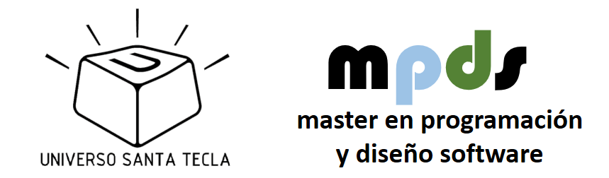

# Iteraciones

|    |    |    |    |
|----|----|----|----|
| [1-fundamentos-git](iteraciones/1-fundamentos-git.md) | [2-patrones-uml](iteraciones/2-patrones-uml.md) | [3-conocimiento](iteraciones/3-conocimiento.md) | [4-plantuml](iteraciones/4-plantuml.md) |
| |  |  |  |
| |  |   |  |
| |  |   |  |
| |  |  |  |
| |  |   |  |
| |  |   |  |
| |  |  |  |
| |  |   |  |
| |  |   |  |
| |  |  |  |
| |  |   |  |
| |  |   |  |
| |  |  |  |

